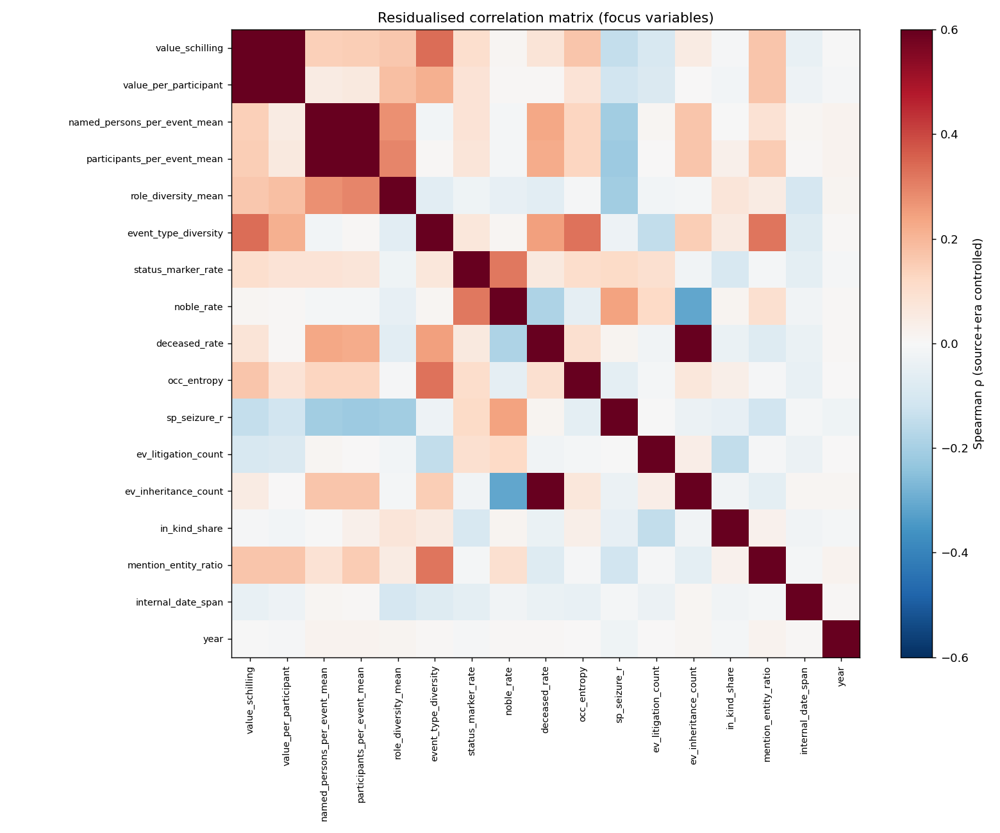
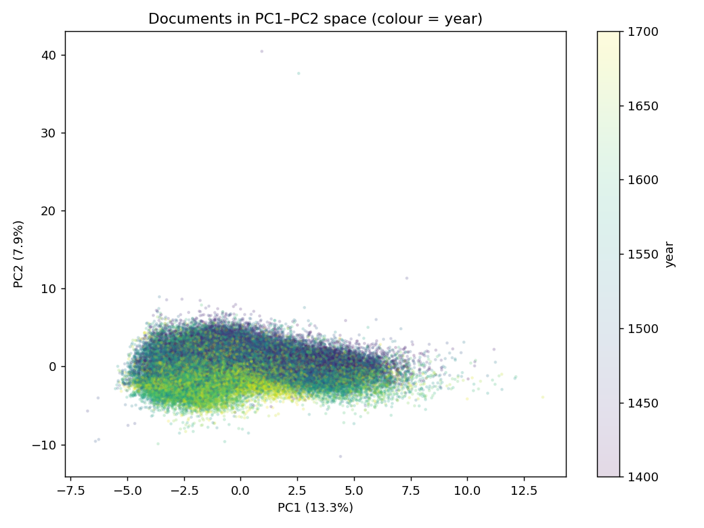

# HGB feature correlation & pattern analysis

Documents: **75,447**, raw columns: 153

## 1. Comparability transforms applied

- 53 numeric features; 10 log1p-transformed; all z-scored.
- Residualised against **source (165 archives) + 25y time_bin** to net out provenance/era confounds.

## 2. Strongest correlations (Spearman)

### Raw (top 18)

| variable A | variable B | ρ |
|---|---|---|
| sp_title_r | status_marker_rate | +0.997 |
| ev_seizure_count | sp_seizure_r | +0.973 |
| participants_per_event_mean | named_persons_per_event_mean | +0.964 |
| ev_litigation_count | sp_litigation_r | +0.945 |
| value_per_participant | value_schilling | +0.945 |
| event_type_diversity | n_events | +0.935 |
| conf_std | conf_mean | -0.916 |
| sp_dead_r | deceased_rate | +0.904 |
| occ_entropy | n_occ_distinct | +0.901 |
| ev_ownership_count | sp_owner_r | +0.893 |
| sp_occ_r | n_occ_distinct | +0.808 |
| n_events | n_tokens | +0.728 |
| sp_title_r | master_rate | +0.698 |
| master_rate | status_marker_rate | +0.696 |
| ev_property-purchase_count | price_per_property | +0.673 |
| event_type_diversity | n_tokens | +0.672 |
| distinct_entities | n_events | +0.648 |
| ev_inheritance_count | deceased_rate | +0.636 |

### After source+era control (top 18) — associations that survive confounds

| variable A | variable B | ρ_resid |
|---|---|---|
| sp_title_r | status_marker_rate | +0.980 |
| ev_litigation_count | sp_litigation_r | +0.969 |
| participants_per_event_mean | named_persons_per_event_mean | +0.966 |
| value_per_participant | value_schilling | +0.946 |
| ev_seizure_count | sp_seizure_r | +0.935 |
| occ_entropy | n_occ_distinct | +0.903 |
| event_type_diversity | n_events | +0.882 |
| conf_std | conf_mean | -0.878 |
| sp_dead_r | deceased_rate | +0.878 |
| ev_ownership_count | sp_owner_r | +0.845 |
| sp_occ_r | n_occ_distinct | +0.763 |
| sp_title_r | master_rate | +0.730 |
| master_rate | status_marker_rate | +0.727 |
| ev_inheritance_count | deceased_rate | +0.688 |
| n_events | n_tokens | +0.626 |
| sp_occ_r | occ_entropy | +0.582 |
| event_type_diversity | n_tokens | +0.581 |
| distinct_entities | n_tokens | +0.573 |

## 3. PCA — which variables co-move

Explained variance: PC1=13.3%, PC2=7.9%, PC3=6.4%, PC4=5.1%, PC5=4.7%  (cumulative 5 = 37.4%)

**PC1** top loadings: event_type_diversity (+0.32), n_events (+0.31), distinct_entities (+0.30), n_tokens (+0.27), value_schilling (+0.27), n_occ_distinct (+0.26), occ_entropy (+0.25), price_per_property (+0.25)
**PC2** top loadings: sp_fac_r (+0.31), participants_per_event_mean (-0.31), named_persons_per_event_mean (-0.30), conf_mean (-0.29), conf_std (+0.27), sp_loc_r (+0.26), sp_owner_r (+0.24), ev_ownership_count (+0.20)
**PC3** top loadings: currency_count (-0.33), sp_per_r (+0.29), sp_money_r (-0.28), named_persons_per_event_mean (+0.26), ev_due-obligation_count (-0.23), participants_per_event_mean (+0.23), sp_litigation_r (+0.23), ev_litigation_count (+0.22)

## 4. Emergent document types (KMeans, k=6 on PCA scores)

|   cluster |   value_schilling |   named_persons_per_event_mean |   event_type_diversity |   status_marker_rate |   deceased_rate |   sp_seizure_r |   ev_inheritance_count |   ev_litigation_count |   in_kind_share |   year |   n_docs | top_event_combo                                               | top_source     |
|----------:|------------------:|-------------------------------:|-----------------------:|---------------------:|----------------:|---------------:|-----------------------:|----------------------:|----------------:|-------:|---------:|:--------------------------------------------------------------|:---------------|
|         0 |             30    |                           1.25 |                      4 |                    0 |            0.33 |              0 |                      1 |                     0 |               0 |   1620 |     7887 | inheritance                                                   | Gerichtsarchiv |
|         1 |             21.25 |                           1    |                      2 |                    0 |            0    |              0 |                      0 |                     0 |               0 |   1590 |    20226 | due-payment                                                   | Spital         |
|         2 |             40    |                           1    |                      3 |                    0 |            0    |              0 |                      0 |                     1 |               0 |   1584 |     5777 | litigation|ownership|topological                              | Gerichtsarchiv |
|         3 |           2002    |                           1.11 |                      6 |                    0 |            0    |              0 |                      0 |                     0 |               0 |   1505 |    19639 | due-obligation|family|ownership|property-purchase|topological | Gerichtsarchiv |
|         4 |             35    |                           0.6  |                      3 |                    0 |            0    |              0 |                      0 |                     0 |               0 |   1503 |    17322 | topological                                                   | Gerichtsarchiv |
|         5 |            100    |                           1    |                      3 |                    1 |            0    |              0 |                      0 |                     0 |               0 |   1610 |     4596 | property-purchase|topological                                 | Gerichtsarchiv |

## 5. Event-type co-occurrence (PMI & lift)

### Most positively associated event pairs (top lift)

| event_a           | event_b           |   p_joint |   lift |   pmi |   n_docs |
|:------------------|:------------------|----------:|-------:|------:|---------:|
| pledge            | debt              |     0.002 | 31.852 | 4.993 |      155 |
| civic-affiliation | rent-purchase     |     0.018 |  4.009 | 2.003 |     1390 |
| rent-purchase     | redemption        |     0.007 |  3.066 | 1.616 |      504 |
| civic-affiliation | pledge            |     0.002 |  3.059 | 1.613 |      118 |
| family            | bequest           |     0.012 |  2.908 | 1.54  |      910 |
| civic-affiliation | redemption        |     0.007 |  2.837 | 1.505 |      552 |
| civic-affiliation | debt              |     0.002 |  2.492 | 1.317 |      129 |
| civic-affiliation | transfer          |     0.001 |  2.424 | 1.278 |       91 |
| property-purchase | civic-affiliation |     0.042 |  2.412 | 1.27  |     3161 |
| redemption        | debt              |     0.001 |  2.404 | 1.265 |       59 |
| family            | rent-purchase     |     0.048 |  2.4   | 1.263 |     3637 |
| inheritance       | membership        |     0.011 |  2.33  | 1.221 |      854 |

### Most *under*-associated (lowest lift, avoided combinations)

| event_a           | event_b           |   p_joint |   lift |    pmi |   n_docs |
|:------------------|:------------------|----------:|-------:|-------:|---------:|
| due-payment       | seizure           |     0.001 |  0.037 | -4.773 |      101 |
| due-obligation    | litigation        |     0.002 |  0.083 | -3.585 |      154 |
| due-payment       | property-purchase |     0.006 |  0.087 | -3.527 |      424 |
| seizure           | rent-purchase     |     0.001 |  0.118 | -3.08  |       74 |
| property-purchase | litigation        |     0.002 |  0.164 | -2.607 |      153 |
| property-purchase | rent-purchase     |     0.003 |  0.226 | -2.147 |      250 |
| due-obligation    | bequest           |     0.001 |  0.245 | -2.03  |      111 |
| inheritance       | litigation        |     0.001 |  0.245 | -2.028 |       92 |

### Lift of top pairs across 25-year bins (pattern stability)

| pair | 1400 | 1425 | 1450 | 1475 | 1500 | 1525 | 1550 | 1575 | 1600 | 1625 | 1650 | 1675 | 1700 |
|---|---|---|---|---|---|---|---|---|---|---|---|---|---|
| pledge×debt | 15.96 | 22.07 | 12.43 | 19.84 | 31.42 | 58.12 | 56.11 | 48.26 | 50.76 | 31.52 | 40.33 | 54.65 | · |
| civic-affiliation×rent-purchase | 1.59 | 3.01 | 3.35 | 2.59 | 2.16 | 2.83 | 5.95 | 12.38 | 16.41 | 17.00 | 6.06 | 21.00 | · |
| rent-purchase×redemption | 1.63 | 2.81 | 2.17 | 1.48 | 1.86 | 1.61 | 6.41 | 9.28 | 11.35 | 14.63 | · | 3.50 | · |
| civic-affiliation×pledge | 0.84 | 1.25 | 0.70 | 2.24 | 2.24 | 2.86 | 5.54 | 7.34 | 14.24 | 10.61 | 14.63 | 22.75 | · |

## 6. Categorical associations

### Cramér's V among categoricals

|                 |   source |   time_bin |   language |   dossiertype |   cluster |   gov_org_present |
|:----------------|---------:|-----------:|-----------:|--------------:|----------:|------------------:|
| source          |    1     |      0.275 |      0.291 |         0.11  |     0.338 |             0.415 |
| time_bin        |    0.275 |      1     |      0.115 |         0.04  |     0.233 |             0.269 |
| language        |    0.291 |      0.115 |      1     |         0.102 |     0.081 |             0.06  |
| dossiertype     |    0.11  |      0.04  |      0.102 |         1     |     0.065 |             0.035 |
| cluster         |    0.338 |      0.233 |      0.081 |         0.065 |     1     |             0.512 |
| gov_org_present |    0.415 |      0.269 |      0.06  |         0.035 |     0.512 |             1     |

### Correlation ratio η (categorical → numeric); higher = category explains more variance

|          |   value_schilling |   named_persons_per_event_mean |   status_marker_rate |   in_kind_share |   event_type_diversity |   sp_seizure_r |
|:---------|------------------:|-------------------------------:|---------------------:|----------------:|-----------------------:|---------------:|
| source   |             0.704 |                          0.339 |                0.16  |           0.251 |                  0.595 |          0.372 |
| time_bin |             0.159 |                          0.209 |                0.128 |           0.088 |                  0.255 |          0.25  |
| cluster  |             0.71  |                          0.491 |                0.773 |           0.108 |                  0.723 |          0.336 |

## 7. Spatial autocorrelation (Moran's I, k-nearest=8)

Geo-located unique dossiers: 3,694

| variable | Moran's I |
|---|---|
| value_schilling | +0.104 |
| status_marker_rate | +0.028 |
| noble_rate | +0.057 |
| sp_seizure_r | +0.029 |
| named_persons_per_event_mean | +0.036 |
| in_kind_share | +0.109 |
| ev_litigation_count | +0.026 |

(I≈0 random; I>0 spatially clustered; I<0 dispersed)
